# 🧬 SciFlow Pro — 科研全流程智能工作站

<p align="center">
  
  
  
  
  
</p>

> **一站式科研数据处理、论文写作与协作平台**
> 
> 从立项到发表，覆盖科研工作的每一个环节。

---

## ✨ 核心亮点

- 🤖 **多模型 AI 引擎** — 支持 GPT-5/Gemini/Claude/DeepSeek/Qwen/Moonshot/Llama 等 30+ 模型，智能路由自动选择最优模型
- 📊 **专业科研绘图** — 期刊级图表、桑基图、弦图、时间线、机理图，一键达到发表标准
- 🔬 **全表征数据分析** — XRD/XPS/SEM/TEM/BET 等数据导入即分析
- ✍️ **学术写作工坊** — 多栏排版、LaTeX 公式、文献引用、AI 润色，所见即所得
- ☁️ **云端协作** — 多人实时协同编辑，项目进度一目了然
- 💻 **跨平台** — 支持 macOS (Apple Silicon) 和 Windows

### 🤖 AI 如何贯穿你的科研全流程

| 科研阶段 | AI 做了什么 |
|:--------:|:-----------|
| 📌 **选题立项** | 生成科学假设、全球竞争态势散点图、虚拟评审委员会模拟答辩 |
| 📚 **文献研究** | 批量摘要提取、文献对比矩阵、知识图谱构建、研究空白识别 |
| ⚗️ **实验设计** | DOE 参数推荐（三种调性）、实验方案生成、自然语言转流程图 |
| 🔬 **数据表征** | XRD 智能物相检索 (COD)、XPS 化学态分析、SEM/TEM 形貌识别、一键 Benchmark |
| ⚛️ **机理推演** | 反应路径预测、催化机理图生成、多角度专家辩论论证 |
| ✍️ **论文写作** | 三档润色（纠错/优化/学术改写）、引文自动推荐、图表交叉引用、多期刊格式适配 |
| 🎙️ **实验记录** | 语音实验伴侣（解放双手）、零散笔记自动结构化 |

> 💡 所有 AI 功能均采用**本地优先**架构——你的 API Key 直连模型提供商，科研数据不经过任何第三方服务器，也不会被用于模型训练。

---

## 📸 功能展示

<div align="center">
<table>
<!-- 🚀 第一排：立项与规划 -->
<tr>
<td align="center"><b>📌 项目立项</b><br>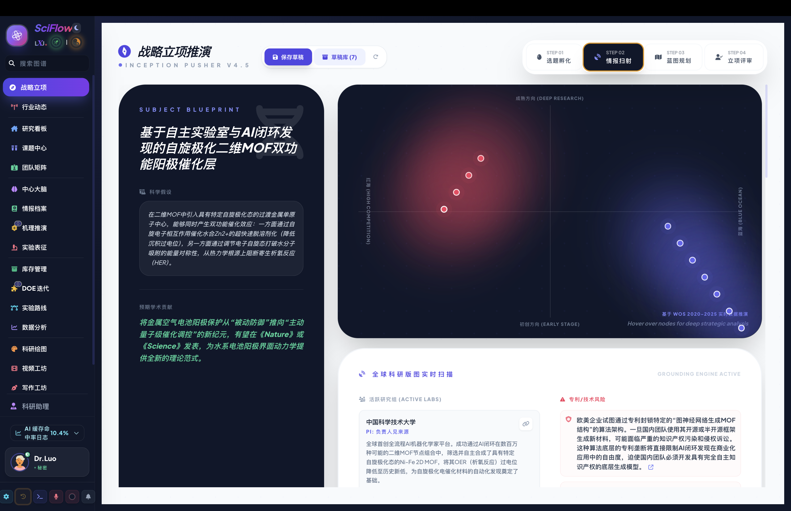</td>
<td align="center"><b>🌐 行业动态</b><br></td>
<td align="center"><b>📋 研究看板</b><br>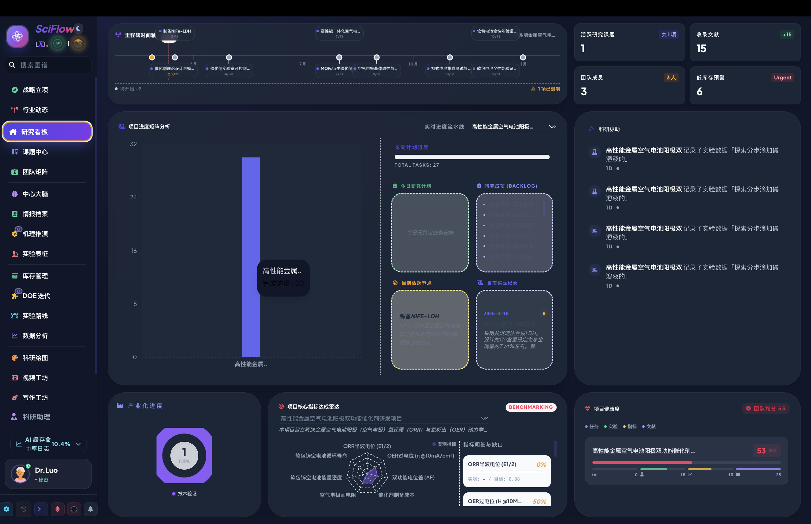</td>
</tr>
<!-- 📖 第二排：文献与情报 -->
<tr>
<td align="center"><b>🔍 文献查找</b><br>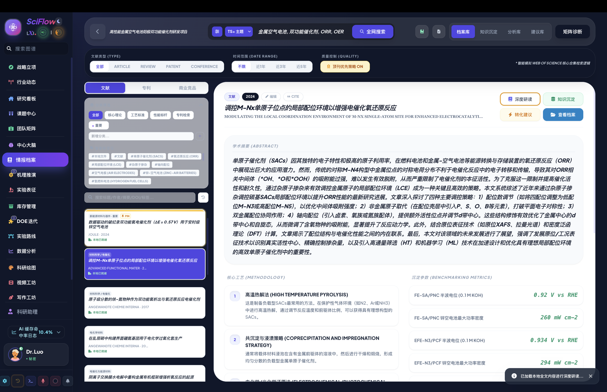</td>
<td align="center"><b>📚 情报档案</b><br>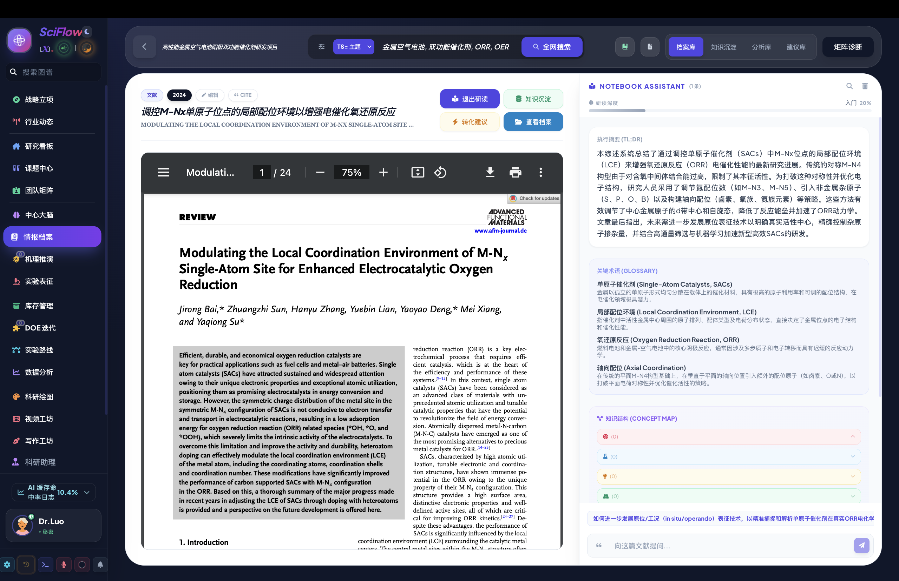</td>
<td align="center"><b>🧠 科研大脑</b><br>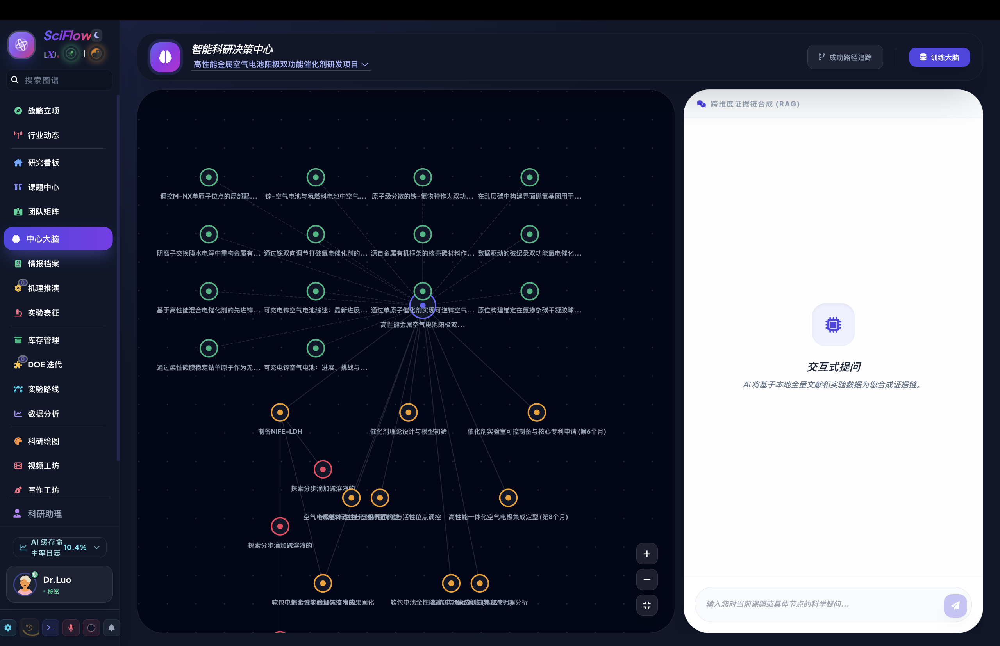</td>
</tr>
<!-- ⚗️ 第三排：实验与工艺 -->
<tr>
<td align="center"><b>📂 课题工作流</b><br></td>
<td align="center"><b>📈 工艺演化</b><br></td>
<td align="center"><b>🏭 工业流程</b><br></td>
</tr>
<!-- 🔬 第四排：分析与推演 -->
<tr>
<td align="center"><b>🔬 表征分析</b><br>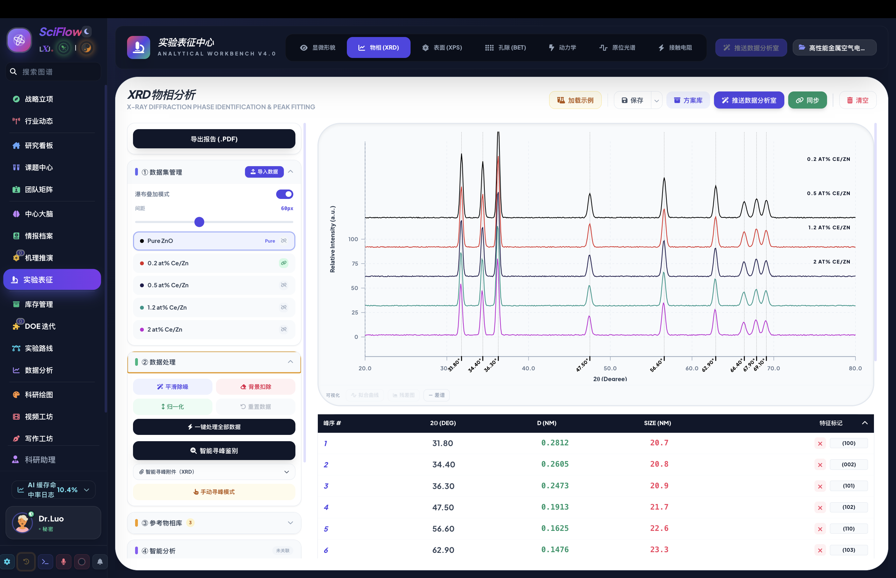</td>
<td align="center"><b>⚛️ 机理推演</b><br>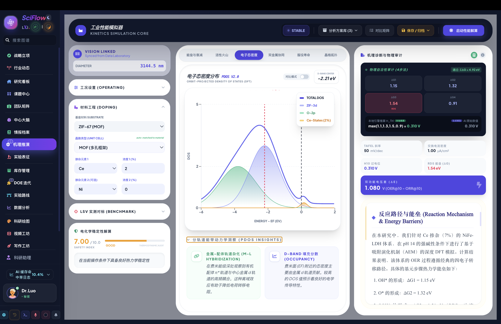</td>
<td align="center"><b>🤖 AI 智能助手</b><br>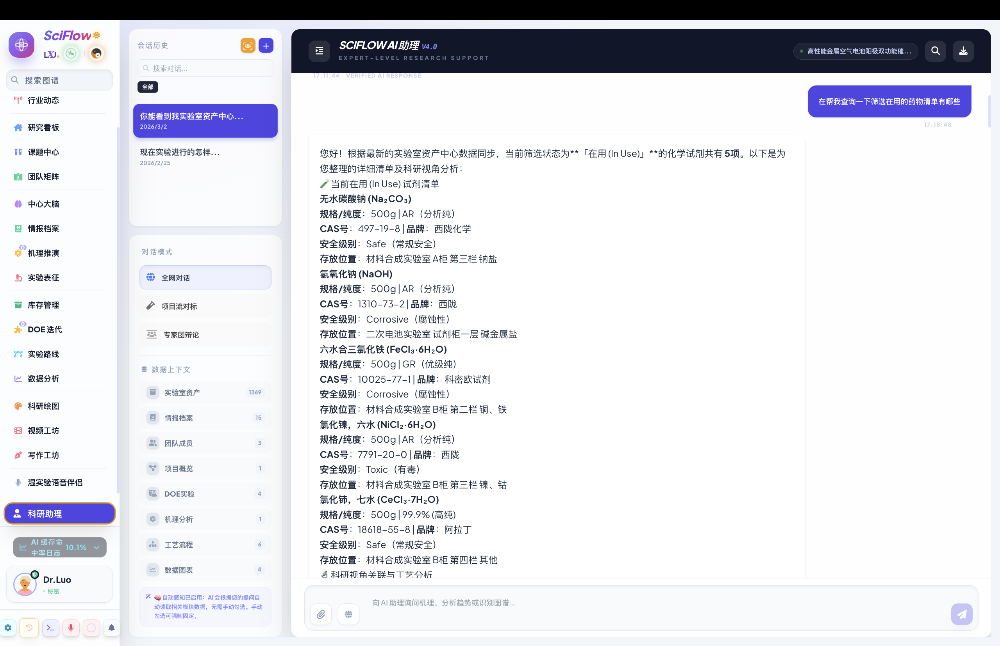</td>
</tr>
<!-- 🎨 第五排：科研可视化 -->
<tr>
<td align="center"><b>🎨 绘图中心</b><br>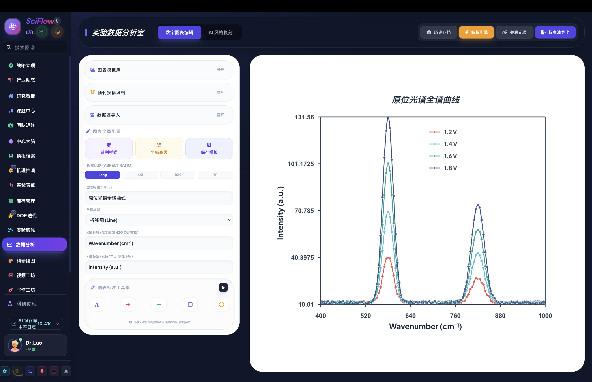</td>
<td align="center"><b>📖 文献绘图</b><br>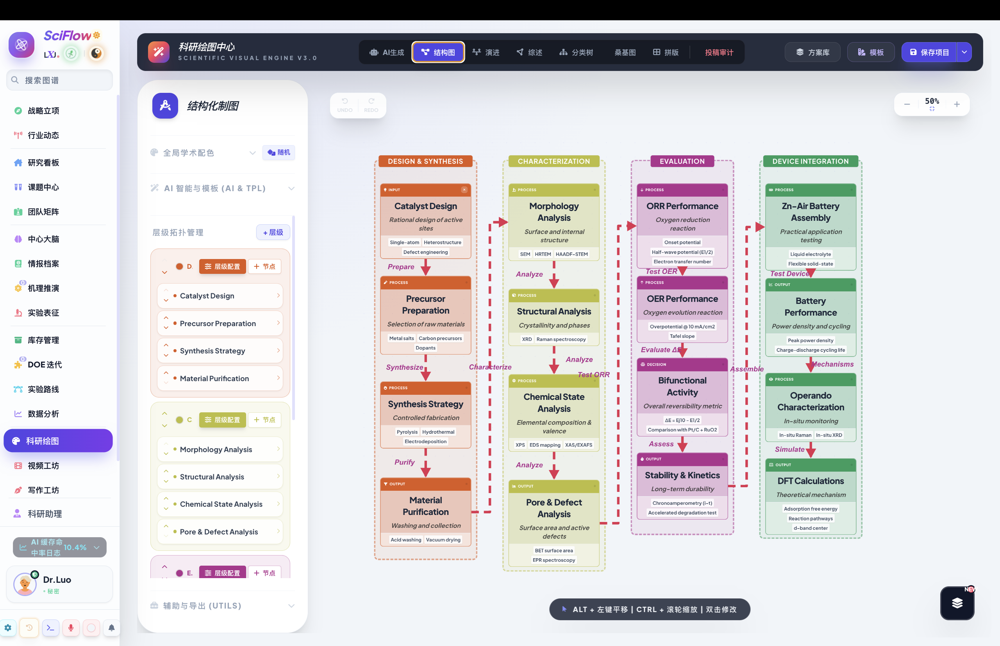</td>
<td align="center"><b>🔄 综述绘图</b><br>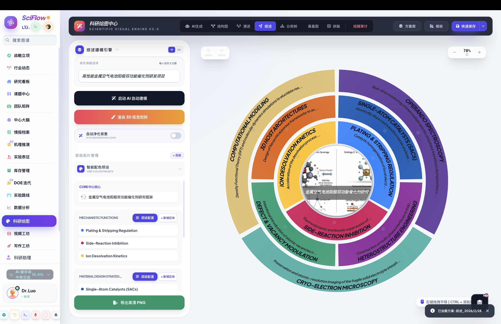</td>
</tr>
<!-- ✍️ 第六排：写作与协作 -->
<tr>
<td align="center"><b>✍️ 写作工坊</b><br>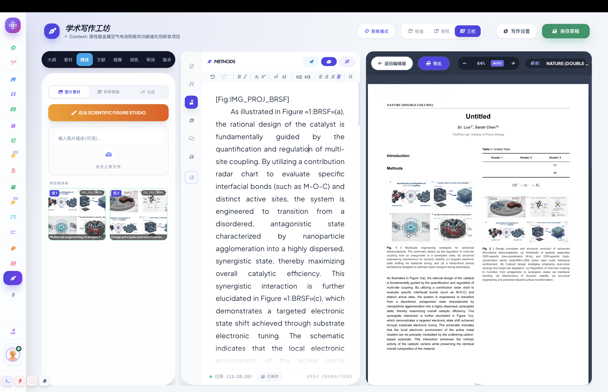</td>
<td align="center"><b>🖼️ 图表拼版</b><br>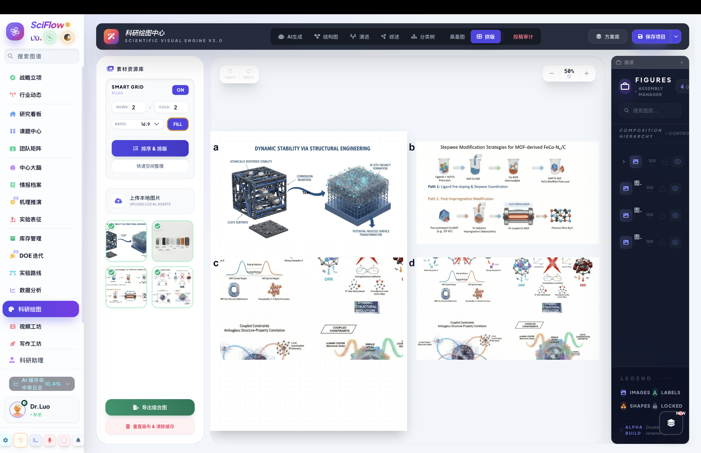</td>
<td align="center"><b>👥 人员矩阵</b><br></td>
</tr>
</table>
</div>

---

## 📦 下载安装

| 平台 | 下载链接 | 系统要求 |
|:----:|---------|---------|
| 🍎 **macOS** | [SciFlow-Pro-1.0.0-arm64.dmg](https://github.com/gwennsteglik252-create/sciflow-releases/releases/download/v1.0.0/SciFlow-Pro-1.0.0-arm64.dmg) | macOS 12+ (Apple Silicon) |
| 🪟 **Windows** | [SciFlow-Pro-Setup-1.0.0.exe](https://github.com/gwennsteglik252-create/sciflow-releases/releases/download/v1.0.0/SciFlow-Pro-Setup-1.0.0.exe) | Windows 10/11 (64-bit) |

<details>
<summary>🪟 <strong>Windows 安装步骤</strong>（点击展开）</summary>

1. 下载 `.exe` 安装包
2. 双击运行安装程序
3. 如果弹出 **SmartScreen 蓝色警告**，点击 「更多信息」 → 「仍要运行」
4. 按提示完成安装即可

</details>

<details>
<summary>🍎 <strong>macOS 安装步骤</strong>（点击展开）</summary>

1. 下载 `.dmg` 文件并双击打开
2. 将 SciFlow Pro 拖入 **Applications** 文件夹
3. ⚠️ **首次打开前**，需要在终端执行以下命令（解除安全限制）：

```bash
sudo xattr -cr "/Applications/SciFlow Pro.app"
```

**操作方法**：
- 按 `Command + 空格键`，输入「终端」并回车打开
- 将上面的命令粘贴到终端中，按回车
- 输入你的电脑开机密码（输入时不会显示字符，这是正常的），再按回车
- 完成！现在可以从启动台打开 SciFlow Pro 了 🎉

> 💡 **为什么需要这一步？** 因为当前版本尚未进行 Apple 公证签名，macOS 会将未签名的应用标记为「不安全」。此命令仅需执行一次，后续更新无需重复。

</details>

---

## 🚀 快速上手

安装完成后，只需三步即可开始你的智能科研之旅：

### Step 1：配置 AI 引擎 🔑
打开 SciFlow Pro → 点击左下角 ⚙️ **设置** → 选择「AI 引擎配置」→ 填入你的 API Key

> 💡 推荐首次使用 **Google Gemini**（免费额度高）或 **DeepSeek**（性价比高）

### Step 2：创建第一个课题 📌
点击侧边栏「**战略立项**」→ 输入你的研究方向关键词 → AI 将自动生成科学假设和竞争态势分析 → 一键转为正式课题

### Step 3：开始科研工作流 🔬
课题创建后，你可以：
- 📚 **文献查找** → 检索相关文献并导入情报档案
- 📂 **课题工作流** → 拆解实验任务、管理实验矩阵
- 🔬 **表征分析** → 上传 XRD/XPS 数据，AI 自动分析
- ✍️ **写作工坊** → 开始撰写论文，AI 辅助润色

---

## 🎯 适用人群

SciFlow Pro 专为以下科研工作者设计：

| 人群 | 典型使用场景 |
|:----:|:------------|
| 🎓 **研究生** | 文献管理、实验数据处理、毕业论文写作 |
| 🔬 **博士后 / 青年学者** | 课题规划、表征数据分析、高水平论文投稿 |
| 👨‍🏫 **PI / 课题组长** | 团队管理、项目看板、多课题进度追踪 |
| 🏭 **科研型企业 R&D** | DOE 实验设计、工艺演化、工业流程优化 |


---

## 🧩 功能模块详解

SciFlow Pro 内置 **17 个深度集成的功能模块**，覆盖科研工作的完整生命周期：

<details open>
<summary><b>🚀 选题与立项</b></summary>

#### � 战略立项 · Inception Pusher v4.5

AI 驱动的课题孵化引擎，通过四个递进阶段完成从灵感到正式立项的全过程：

| 阶段 | 名称 | 核心能力 |
|:----:|:----:|:---------|
| STEP 01 | **选题孵化** | 输入研究方向的关键词，AI 自动生成科学假设（Subject Blueprint），包含核心理论依据、预期学术贡献和创新点分析 |
| STEP 02 | **情报扫射** | 基于 Web of Science 2020-2025 实时数据生成**全球科研版图散点图**（竞争态势 vs 创新方向），识别活跃课题组和专利/技术风险 |
| STEP 03 | **蓝图规划** | Monte Carlo 引擎模拟 5-7 年研究风险与 KPI 预测，自动合成高保真战略推演蓝图 (Master Blueprint) |
| STEP 04 | **立项评审** | 组建虚拟评审委员会（Dr. Rigor 严谨派 / Dr. Nova 创新派 / Dr. Forge 工程派），模拟答辩攻防，生成多维度立项评分报告 |

- 支持草稿库保存和加载，方便多版本迭代
- 评审通过后可一键转为正式课题，自动进入课题工作流

#### 🌐 行业动态

实时追踪目标领域的前沿动向，AI 引擎自动聚合多源信息：

- 🔔 **科研快讯**：自动推送目标期刊的最新论文、高引文献突变（Citation Burst）
- 📜 **专利预警**：监控相关技术领域的专利公开和授权信息
- 🏛️ **政策追踪**：聚合国内外科技基金、项目申报和顶层政策变化
- 📊 **竞品分析**：追踪主要竞争课题组的发文频率、合作网络和技术路线变化

#### � 研究看板

课题组的数字化指挥中心：

- 📈 **项目总览仪表盘**：进度条、里程碑状态、预算消耗燃尽图
- 📅 **项目计划**：甘特图模式管理任务时间线和依赖关系
- 🏷️ **成果汇报**：一键导出课题阶段性报告，支持 PPT/PDF 格式
- 🎯 **归档库**：历史课题的归档与检索

</details>

<details>
<summary><b>📖 文献与情报</b></summary>

#### 🔍 文献查找

内置学术搜索引擎，支持 Web of Science 核心合集检索逻辑：

- **多维检索**：按主题词 (TS)、作者、期刊名、DOI 等组合检索
- **文献类型筛选**：Article / Review / Patent / Conference 分类过滤
- **时间范围**：不限 / 近 1 年 / 近 3 年 / 近 5 年
- **质量控制**：顶刊优先策略 (ON/OFF)，基于影响因子智能排序
- **AI 矩阵诊断**：自动检测检索结果中的研究空白区域
- **一键入档**：搜索结果直接保存为情报档案，自动提取元数据

#### � 情报档案

文献的深度管理与研读引擎：

- **档案库管理**：支持多分类标签体系（核心理论 / 工艺标准 / 性能标样 / 专利检索），每篇文献可属于多个分类
- **AI 深度研读**：一键生成文献的学术摘要、核心工艺 (Methodology)、沉淀参数 (Benchmarking Metrics) 提取报告
- **知识沉淀**：将文献中的关键数据点沉淀为结构化知识条目，供后续引用
- **转化建议**：AI 分析文献中的方法对你当前课题的可转化性
- **本地文件管理**：PDF 标记为「本地已精读」状态，支持数据追溯

#### 🧠 科研大脑

课题的知识图谱与跨域关联引擎：

- **节点关系图**：自动构建文献之间的引用网络、概念关联和知识脉络
- **自动聚类**：AI 识别文献群落中的核心议题和关键桥梁论文
- **研究空白发现**：通过知识图谱中的稀疏区域，自动标记潜在创新机会
- **交互式探索**：支持点击节点查看文献详情，拖拽调整关系权重

</details>

<details>
<summary><b>⚗️ 实验与工艺</b></summary>

#### 📂 课题工作流

基于 **TRL（技术成熟度分级系统）** 的课题全生命周期管理：

- **拓扑节点树**：课题按层级拆解为多个拓扑节点，支持无限层级嵌套
- **实验组对比管理**：每个节点下可创建多个实验组，自动对比关键参数差异
- **AI 对比分析**：一键生成组间表征对比分析报告，包含 XRD 物相、性能指标等
- **TRL 进度追踪**：当前阶段可视化标记（TRL 1-9），从基础研究到工程验证全程可追溯
- **多视图切换**：工作流 / 工艺路线 / 实验矩阵 / 样本矩阵 / 项目计划 / 归档库 / 成果汇报

#### 🧪 实验矩阵 · � 工艺演化 · 🏭 工业流程

- **联合对标设计**：自定义实验参数维度，自动生成参数组合矩阵，PID 自动编号
- **TRL 演化追踪**：可视化展示从实验室配方到中试/量产的参数演化路径
- **工业放大预测**：输入实验室参数，模拟产线级别的工艺流程和成本效益

#### 🔀 实验路线

拖拽式编辑实验步骤节点，支持多分支 A/B 方案对比，自然语言转标准流程图

#### ⭐ DOE 迭代

- **正交矩阵**：支持 L4 / L9 / Anchor 等多种标准矩阵
- **AI 推荐**：三种调性（Aggressive / Conservative / Exploration）推荐下一轮参数组合
- **同步到课题**：DOE 推荐的方案一键同步到实验矩阵

</details>

<details>
<summary><b>🔬 分析与表征</b></summary>

#### 🔬 实验表征中心

一站式表征数据分析平台（XRD / XPS / SEM / TEM / BET），支持从原始数据到学术结论的完整链路。包含 COD 数据库智能物相检索、Bragg 方程计算、AI 视觉模型形貌分析、一键 Benchmark 对标报告等。

#### ⚛️ 机理推演工坊

AI 驱动的反应机理可视化模拟器：参数化建模 → 机理图自动生成 → 比较矩阵 → 理论描述符计算 → AI 多角度辩论论证

#### 📊 数据分析室

实验数据的高级可视化与统计分析：图表配置 → 多系列叠加 → 异常值检测 → 模板复用

</details>

<details>
<summary><b>🎨 科研可视化</b></summary>

#### 🎨 绘图中心 · Scientific Visual Engine v3.0

支持 **20+ 种学术图表类型**（柱状图/折线图/桑基图/弦图/时间线/机理图等），内置 Nature/Science/IEEE 等学术配色，支持 LaTeX 标注，高清导出 SVG/PNG/PDF

#### 📖 文献绘图 · 🔄 综述绘图

文献性能对比散点图、弦图关联网络、桑基图技术演进路径、时间线研究脉络

#### 🖼️ 图表拼版 · Figure Assembly

多图拖拽拼版 → 统一标注 Fig. 1a/1b/1c → 期刊尺寸规范 → 高清导出（600 DPI）

</details>

<details>
<summary><b>✍️ 写作与协作</b></summary>

#### ✍️ 写作工坊

学术论文全功能编辑器：多栏排版 + LaTeX 公式 + AI 三档润色 + 引文自动管理 + 图表交叉引用 + 发表级预览 + 素材侧边栏（大纲/素材/文献/镜像/润色/审阅/版本）

#### 🎬 视频工坊 · 👥 人员矩阵 · � 库存管理

科研视频制作 | 团队角色管理与在线协作 | 实验室耗材出入库与低库存预警

</details>

---

## ⚙️ 系统设置

### 🔧 多模型 AI 引擎配置
| 引擎 | 支持模型 |
|------|---------|
| **Google Gemini** | Gemini 3.1 Pro · Gemini 2.5 Pro / Flash · Gemini 2.0 Pro / Flash / Flash Lite · Gemini 1.5 Pro / Flash |
| **OpenAI** | GPT-5 · GPT-4o · o2 · o3-mini · GPT-3.5 Turbo |
| **Anthropic** | Claude 4 Opus / Sonnet · Claude 3.7 Sonnet · Claude 3.5 Sonnet / Haiku · Claude 3 Opus |
| **DeepSeek** | DeepSeek V3 · DeepSeek R1 (Reasoner) |
| **Moonshot (Kimi)** | Moonshot V1 8k / 32k / 128k |
| **通义千问 (Qwen)** | Qwen Max · Qwen Plus · Qwen Turbo · Qwen Long · Qwen 2.5 72B / 7B |
| **硅基流动** | DeepSeek V3/R1 · Qwen 2.5 72B/7B（聚合国产模型） |
| **OpenRouter** | Claude 3.5 Sonnet · GPT-4o · Llama 3.1 70B · Gemini Pro 1.5（多模型聚合网关） |
| **豆包 (自定义)** | 支持自定义 Base URL + Model Name，兼容任意 OpenAI 兼容 API |
| 🔄 **智能路由** | 基于任务类型自动选择最优模型（成本优先 / 质量优先两种策略） |

### 🌏 多语言支持
- 界面语言：中文 / English
- AI 输出语言：中文 / English / 自动检测

---

## 🛡️ 隐私与安全

SciFlow Pro 深知科研数据的敏感性，从架构层面确保你的数据安全：

| 特性 | 说明 |
|:----:|:-----|
| 🏠 **本地优先存储** | 所有项目数据、实验记录、论文草稿默认存储在本地 IndexedDB，不经过任何第三方服务器 |
| 🔑 **自有 API Key** | AI 功能使用你自己配置的 API Key 直连模型提供商，SciFlow 不代理也不缓存你的请求 |
| 🔒 **端到端加密** | 云端协作数据传输采用 TLS 加密，服务端存储使用 AES-256 加密 |
| 📴 **离线可用** | 核心功能（写作、绘图、数据管理）完全支持离线运行，不依赖网络连接 |
| 🚫 **不训练模型** | 你的科研数据和论文内容绝不会被用于任何 AI 模型的训练 |

---

## 🏗️ 技术架构

```
┌─────────────────────────────────────────────────┐
│                  SciFlow Pro                     │
├──────────┬──────────┬──────────┬────────────────┤
│  Electron │  React   │  Vite    │  TypeScript    │
├──────────┴──────────┴──────────┴────────────────┤
│              核心功能层                           │
│  📊 Scientific Visual Engine (SVG/Canvas)        │
│  ✍️ Academic Writing Engine (富文本/LaTeX)        │
│  🔬 Characterization Analysis (XRD/XPS/SEM)     │
│  🧠 AI Router (多模型智能路由)                    │
├─────────────────────────────────────────────────┤
│              数据层                               │
│  💾 IndexedDB (本地持久化)                        │
│  ☁️ Supabase (云端协作同步)                       │
└─────────────────────────────────────────────────┘
```

---

## 🗺️ 产品路线图

| 时间 | 计划 | 状态 |
|:----:|:-----|:----:|
| 2026 Q1 | v1.0 首次公开发布（macOS + Windows） | ✅ 已完成 |
| 2026 Q2 | XPS 峰拟合引擎升级 · BET 分析模块完善 · 写作模板库 | 🔧 开发中 |
| 2026 Q3 | Linux 平台支持 · 离线 AI 模型（本地推理）· 多人实时协同编辑增强 | 📋 规划中 |
| 2026 Q4 | iPad / 移动端只读视图 · 插件生态系统 · 更多表征类型（拉曼/红外/TGA） | 💡 调研中 |
| 2027 | 科研知识库 AI Agent · 自动化实验日志 · 与仪器设备直连 | 🔮 远景 |

---

## ❓ 常见问题

<details>
<summary><b>Q: 如何配置 AI 功能的 API Key？</b></summary>

打开 SciFlow Pro → 点击左下角 ⚙️ 设置 → 找到「AI 引擎配置」→ 选择你使用的模型提供商 → 粘贴你的 API Key 即可。

支持的提供商包括：OpenAI、Google Gemini、Anthropic Claude、DeepSeek、通义千问、Moonshot、硅基流动、OpenRouter 等。

</details>

<details>
<summary><b>Q: 我的数据会被上传到云端吗？</b></summary>

**不会。** SciFlow Pro 采用「本地优先」架构，所有数据默认存储在你的电脑本地。只有当你**主动开启**云端协作功能时，项目数据才会通过加密通道同步到云端。AI 功能使用你自己的 API Key 直连模型提供商，SciFlow 不代理请求、不缓存数据。

</details>

<details>
<summary><b>Q: macOS 提示"应用已损坏"或无法打开怎么办？</b></summary>

这是因为当前版本尚未进行 Apple 公证签名。请在终端执行：

```bash
sudo xattr -cr "/Applications/SciFlow Pro.app"
```

执行后即可正常打开，此命令仅需执行一次。

</details>

<details>
<summary><b>Q: 支持哪些文献格式导入？</b></summary>

支持 PDF、BibTeX、RIS、EndNote XML 等主流文献格式的批量导入。导入后 AI 会自动提取元数据（标题、作者、摘要、关键词等）。

</details>

<details>
<summary><b>Q: 绘制的图表可以导出为什么格式？</b></summary>

支持导出为 **SVG**（矢量图，推荐用于论文投稿）、**PNG**（高分辨率位图）、**PDF** 等格式，分辨率可自定义（最高 600 DPI）。

</details>

---

## 📋 更新日志

### v1.0.0 (2026-03-11)
🎉 **首次公开发布**

- ✅ 战略立项与行业动态扫描
- ✅ 多源文献检索与情报档案管理
- ✅ TRL 技术成熟度课题工作流
- ✅ XRD/XPS/SEM/TEM 全表征分析
- ✅ AI 辅助机理推演与反应路径预测
- ✅ 学术写作工坊（多栏排版 + LaTeX + AI 润色）
- ✅ Scientific Visual Engine 科研绘图引擎
- ✅ 多模型 AI 引擎（30+ 模型 / 10 个提供商）
- ✅ 云端实时协作
- ✅ macOS (Apple Silicon) + Windows 双平台支持

---

## 💬 联系与反馈

我们非常重视你的使用体验和建议！

| 渠道 | 说明 |
|:----:|:-----|
| 🐛 **Bug 反馈** | [提交 Issue](https://github.com/gwennsteglik252-create/sciflow-releases/issues) |
| 💡 **功能建议** | [提交 Feature Request](https://github.com/gwennsteglik252-create/sciflow-releases/issues/new?labels=enhancement) |
| 📧 **商务合作** | 请通过 Issue 联系 |

---

<p align="center">
  <strong>© 2026 SciFlow Pro · All Rights Reserved</strong><br>
  <sub>用科技加速科研，让发现更快发生 🚀</sub>
</p>
